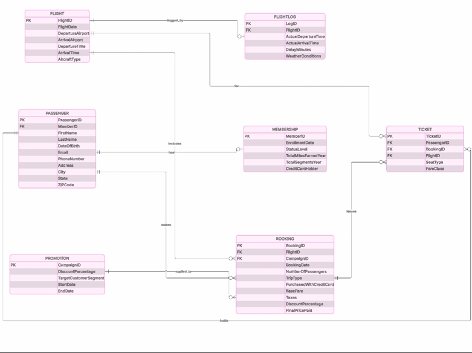
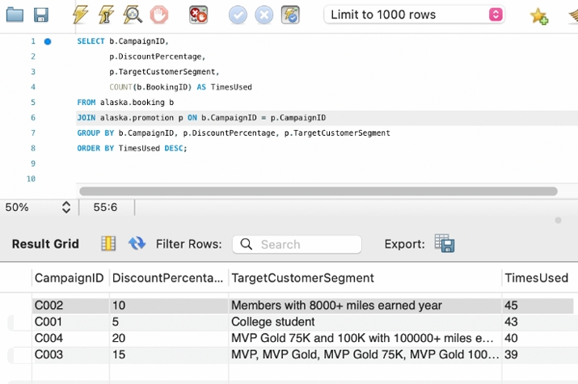
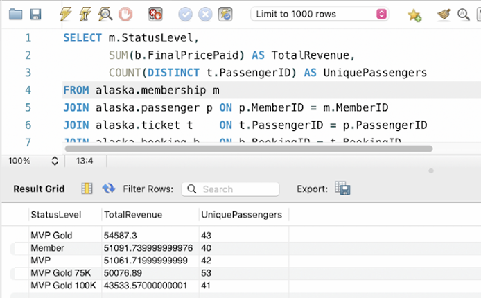
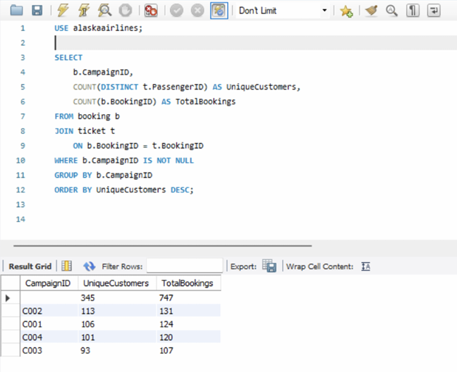
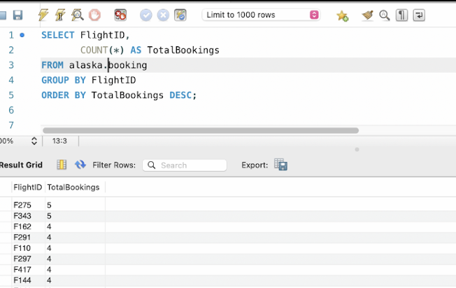
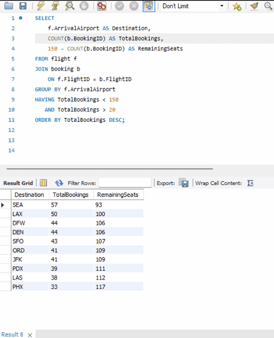

<h1 align="center">Sales Optimization Analysis</h1>

<p align="center">
  A relational database and SQL analysis project examining flight demand,
  customer loyalty, promotional performance, and seat utilization.
</p>

<p align="center">
  
  
  
  
</p>

<p align="center">
  Created by <strong>Annie Nguyen</strong>
</p>

---

<h2 align="center">Project Overview</h2>

The **Sales Optimization Analysis** project uses a relational database and SQL queries to analyze airline booking operations, customer membership activity, promotional campaign performance, flight demand, and available seat capacity.

The database connects passenger, flight, membership, booking, ticket, promotion, and flight-log information. SQL queries are used to transform these records into business insights that can support pricing, marketing, customer retention, and capacity planning decisions.

---

<h2 align="center">Business Problem</h2>

Airlines manage large amounts of operational and customer data, but raw transaction records alone do not clearly explain:

- Which promotions generate the strongest customer response
- Which loyalty groups contribute the most revenue
- Which campaigns attract the largest number of customers
- Which flights receive the most bookings
- Which destinations have unused capacity
- Where additional marketing or pricing adjustments may be needed

This project organizes the data into a structured database and uses SQL analysis to answer these questions.

---

<h2 align="center">Business Objectives</h2>

The primary objectives of this project are to:

1. Design a relational database for airline sales and booking data
2. Establish relationships between operational and customer tables
3. Evaluate promotional campaign performance
4. Compare revenue across membership levels
5. Identify the most frequently booked flights
6. Measure customer participation in marketing campaigns
7. Analyze seat utilization by destination
8. Translate SQL query results into business recommendations

---

<h2 align="center">Database Design</h2>

The database contains seven connected tables:

| Table | Description |
|:---|:---|
| `PASSENGER` | Stores customer identification, contact, and demographic information |
| `MEMBERSHIP` | Stores loyalty enrollment, membership level, miles, and credit card status |
| `FLIGHT` | Stores scheduled flight details, airports, times, and aircraft type |
| `FLIGHTLOG` | Stores actual flight activity, delays, and weather conditions |
| `BOOKING` | Stores reservations, campaigns, passenger counts, prices, and discounts |
| `TICKET` | Connects passengers, bookings, and flights |
| `PROMOTION` | Stores campaign discounts, customer segments, and campaign dates |

---

<h2 align="center">Entity Relationship Diagram</h2>

The Entity Relationship Diagram illustrates how the airline's customer, booking, promotion, ticket, and flight data are connected.

<p align="center">
  
</p>

<h2 align="center">Key Relationship</h2>
- A passenger can create multiple bookings

- A passenger can hold a membership record

- A booking may be associated with a promotional campaign

- A booking can generate one or more tickets

- A ticket connects a passenger with a specific booking and flight

- A flight can contain multiple bookings and tickets
  
- A flight can have an associated operational flight log

---

<h2 align="center">Business Questions And Analysis</h2>

### 1. Which Promotional Campaign Was Used Most Frequently?

This analysis compares promotional campaigns based on the number of bookings associated with each campaign.

<p align="center">
  
</p>

### Findings

| Campaign | Discount | Times Used |
|:---:|---:|---:|
| C002 | 10% | 45 |
| C001 | 5% | 43 |
| C004 | 20% | 40 |
| C003 | 15% | 39 |

Campaign **C002** was the most frequently used promotion, appearing in **45 bookings**. Campaign C001 followed closely with 43 uses.

### Business Interpretation

The results suggest that the largest discount does not automatically generate the highest campaign usage. Customer targeting and campaign relevance may have a stronger influence than discount percentage alone.

The airline should examine why C002 performed well and consider using similar customer-selection criteria in future campaigns.

---

### 2. Which Membership Level Generated the Most Revenue?

This query compares total booking revenue and unique passengers across loyalty membership levels.

<p align="center">
  
</p>

### Findings

| Membership Level | Total Revenue | Unique Passengers |
|:---|---:|---:|
| MVP Gold | $54,587.30 | 43 |
| Member | $51,091.74 | 40 |
| MVP | $51,061.72 | 42 |
| MVP Gold 75K | $50,076.89 | 53 |
| MVP Gold 100K | $43,533.57 | 41 |

### Business Interpretation

**MVP Gold** customers generated the highest total revenue at approximately **$54,587.30**.

However, the **MVP Gold 75K** segment contained the largest number of unique passengers, with 53 customers. This means the segment with the most customers did not produce the highest total revenue.

The airline could investigate average revenue per passenger to determine whether certain membership groups have stronger individual purchasing behavior.

---

### 3. Which Campaign Reached the Most Customers?

This query measures each campaign using both unique customers and total bookings.

<p align="center">
  
</p>

### Findings

| Campaign | Unique Customers | Total Bookings |
|:---:|---:|---:|
| C002 | 113 | 131 |
| C001 | 106 | 124 |
| C004 | 101 | 120 |
| C003 | 93 | 107 |

### Business Interpretation

Campaign **C002** reached the largest number of customers and generated the highest number of bookings:

- 113 unique customers
- 131 total bookings

This result supports the earlier finding that C002 was the strongest campaign based on customer participation.

The airline should analyze the customer segment, timing, and offer structure used in C002 before developing future promotions.

---

### 4. Which Flights Received the Most Bookings?

This analysis ranks flights according to their total number of bookings.

<p align="center">
  
</p>

### Findings

Among the displayed results:

- Flight F275 received 5 bookings
- Flight F343 received 5 bookings
- Several additional flights received 4 bookings

### Business Interpretation

Flights F275 and F343 had the highest booking counts in the query results.

These flights may represent stronger routes, more convenient departure times, or more effective pricing. Additional analysis could compare their airports, schedules, aircraft types, and ticket prices.

---

### 5. Which Destinations Have Available Seat Capacity?

This query compares bookings by arrival airport and calculates remaining seats using an assumed aircraft capacity of 150 seats.

<p align="center">
  
</p>

### Findings

| Destination | Total Bookings | Remaining Seats |
|:---:|---:|---:|
| SEA | 57 | 93 |
| LAX | 50 | 100 |
| DFW | 44 | 106 |
| DEN | 44 | 106 |
| SFO | 43 | 107 |
| ORD | 41 | 109 |
| JFK | 41 | 109 |
| PDX | 39 | 111 |
| LAS | 38 | 112 |
| PHX | 33 | 117 |

### Business Interpretation

Seattle had the highest number of bookings among the displayed destinations, with **57 bookings** and **93 remaining seats**.

Phoenix had the lowest booking total in the result set, with **33 bookings** and **117 remaining seats**.

Destinations with high remaining capacity may benefit from:

- Destination-specific promotions
- Lower prices during low-demand periods
- Loyalty-member incentives
- Bundled travel offers
- Schedule adjustments
- Reduced aircraft capacity when low demand is consistent

---

<h2 align="center">Key Insights</h2>

### Campaign Performance

Campaign C002 produced the strongest overall results. It had:

- The highest number of campaign uses
- The largest number of unique customers
- The highest total number of campaign-related bookings

This campaign should be used as a reference for future promotional strategies.

### Loyalty Program Performance

MVP Gold customers generated the highest total revenue, while MVP Gold 75K had the largest number of unique passengers.

Membership performance should therefore be evaluated using both total revenue and customer-level spending.

### Flight Demand

Flights F275 and F343 had the highest booking totals among the displayed records. The airline could compare these flights with lower-demand flights to identify the factors affecting booking activity.

### Capacity Utilization

Several destinations had more than 100 available seats based on the assumed 150-seat capacity. These routes may require stronger promotional support, pricing adjustments, or capacity planning.

---

<h2 align="center">Recommendation</h2>

### 1. Replicate Successful Campaign Characteristics

Use Campaign C002 as a benchmark by reviewing its:

- Target customer segment
- Discount percentage
- Campaign period
- Customer eligibility rules
- Booking conversion rate

### 2. Develop Membership-Specific Strategies

Provide different offers based on membership behavior:

| Membership Behavior | Recommended Strategy |
|:---|:---|
| High revenue | Premium rewards and personalized travel offers |
| High customer count but lower revenue | Upselling and ticket upgrade opportunities |
| Low activity | Reactivation campaigns |
| Frequent bookings | Loyalty bonuses and referral incentives |

### 3. Improve Low-Demand Routes

For destinations with high remaining capacity:

- Offer limited-time discounts
- Promote travel packages
- Target customers based on previous destinations
- Test alternative departure schedules
- Review whether aircraft capacity matches demand

### 4. Expand Revenue Analysis

Future analysis should include:

- Average revenue per passenger
- Average ticket price by route
- Revenue after discounts
- Revenue by campaign
- Revenue by destination
- Revenue by flight
- Revenue by customer segment

---

<h2 align="center">SQL Techniques Demonstrated</h2>

This project demonstrates the use of:

- `SELECT`
- `FROM`
- `JOIN`
- `GROUP BY`
- `ORDER BY`
- `WHERE`
- `HAVING`
- `COUNT()`
- `COUNT(DISTINCT)`
- `SUM()`
- Aliases
- Aggregate calculations
- Multi-table relational queries

---

<h2 align="center">Tools And Technologies</h2>

| Tool | Purpose |
|:---|:---|
| **MySQL** | Relational database management |
| **MySQL Workbench** | Query development and result validation |
| **SQL** | Data extraction, aggregation, and analysis |
| **Entity Relationship Diagram** | Database structure and relationship design |
| **GitHub** | Project documentation and version control |

---

<h2 align="center">Repository Structure</h2>

```text
sales-optimization-analysis/
│
├── ERD-diagram.jpeg
├── question-1.jpeg
├── question-2.png
├── question-3.png
├── question-4.png
├── question-5.png
├── sales-optimization-analysis.sql
└── README.md
